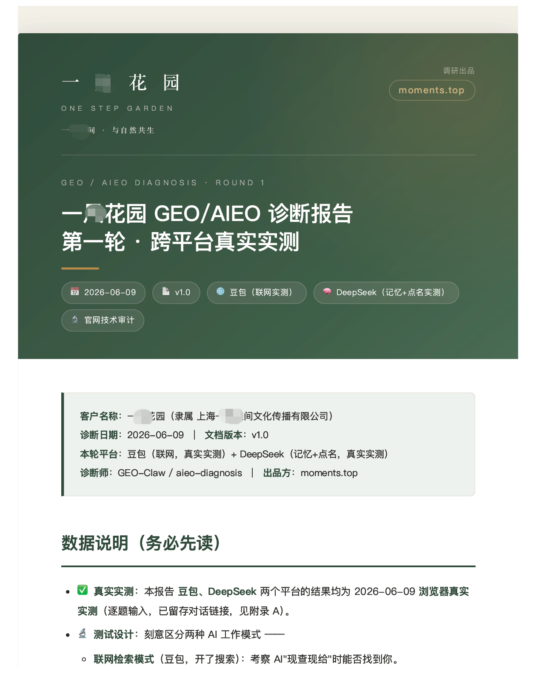
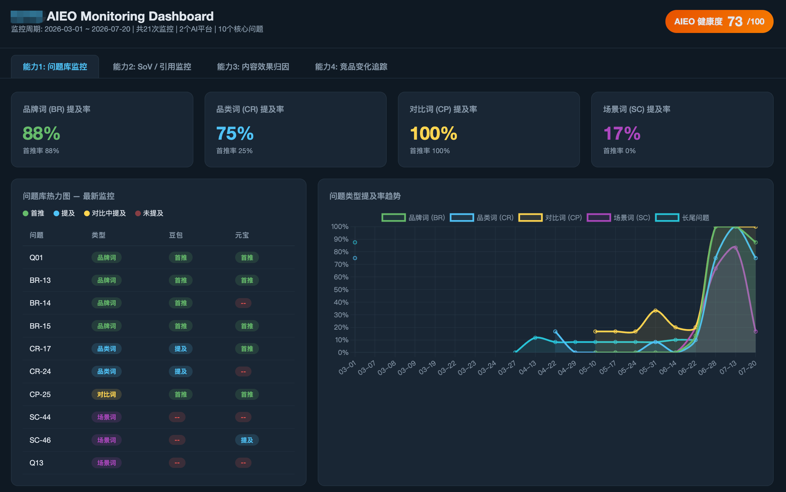
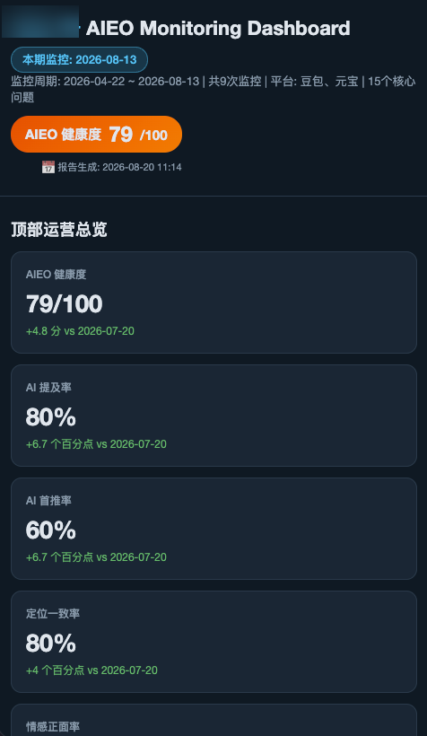

# dsh-moments-aieo

[English](README.md) | 中文

一套 AIEO（AI Engine Optimization，也就是 GEO/AEO —— 让品牌被 ChatGPT、DeepSeek、豆包、Kimi、Perplexity 这类 AI 搜索引用）的交付方法论，打包成 DeepSeek Harness 的一个 bundle。方法分四段——**诊断 → 定位 → 内容 → 监控**——由同一份问题库串起来：诊断起草、定位修正、内容消费、监控度量。本 bundle 提供其中属于方法而非写作的三段——诊断、定位、监控——以及问题库本身，注册为一个独立命名的 skill provider。内容那段消费这份问题库，由你已有的写作 skill 承接。




## 插件

需要 `ctx.skills`（`inject: ['skills']`）。

插件本体刻意做得很薄：以 `includeDefaultRoots: false` 挂载 [`@deepseek-ai/dsh-skill-filesystem`](https://github.com/deepseek-ai/deepseek-harness/tree/main/packages/skill/skill-filesystem)，扫描自己的 `skills/` 目录。所以这套 skill 注册在一个独立 provider 名下，不会跟 `~/.dsh/skills`、`~/.agents/skills` 里的同名 skill 打架。扫描、watch、frontmatter 解析一行都没有重写。

### 配置

| 字段 | 默认值 | 含义 |
|---|---|---|
| `skillsDir` | 包自带的 `skills/` | 存放 `<name>/SKILL.md` 的目录。开发时指向工作树。 |
| `providerName` | `moments-aieo` | 注册到 `ctx.skills` 的 provider 名，与用户自己的 skill 根隔离。 |

## 安装

```sh
dsh plugin --profile web add github:Kenerlee/dsh-moments-aieo   # 直接从 GitHub 装
dsh plugin --profile web add file:/clone/的路径                  # 从本地 clone 装
```

然后在 `~/.dsh/profiles/web/package.json` 的 bundle 列表里加上包名：

```json
{ "dsh": { "profile": { "bundles": [
  "@deepseek-ai/dsh-base",
  "@deepseek-ai/dsh-web-app",
  "dsh-moments-aieo"
] } } }
```

bundle 自带的 `cordis.patch.yml` 会插入那一行，所以不需要你写 profile patch。想换成自己的 skill 目录，在 `~/.dsh/profiles/web/cordis.patch.yml` 里按 id 覆盖：

```yaml
- id: moments-aieo
  config:
    skillsDir: /你的绝对路径/skills
```

不启动就验证：

```sh
dsh --profile web --dump-config | grep -A 4 'id: moments-aieo'
```

## 浏览器自动化

`moments-aieo-diagnosis` 和 `moments-aieo-monitoring` 要用 Playwright 实测各 AI 搜索平台。dsh 通过 [`dsh-mcp-client`](https://github.com/deepseek-ai/deepseek-harness/tree/main/packages/mcp/mcp-client) 接 MCP，工具名注册为 `mcp__<serverName>__<rawName>`——**和 Claude Code 是同一套命名**，所以 skill 正文里的 `mcp__playwright__browser_*` 只要 serverName 叫 `playwright` 就能直接解析：

```yaml
- insert:
    - id: mcp-playwright
      name: '@deepseek-ai/dsh-mcp-client'
      config:
        serverName: playwright
        command: npx
        args: ['@playwright/mcp@latest']
```

不配也能跑，只是这两个 skill 只剩技术审计和报告骨架，平台可见性实测那部分会缺。

## 截图

真实客户交付的诊断报告与监控面板，品牌信息已打码。





## 包含的 skills

| Skill | 用途 |
|---|---|
| `moments-aieo-diagnosis` | 品牌 AI 可见性诊断，产出诊断报告 + 问题库初稿 |
| `moments-aieo-positioning` | 基于 AIEO 改造版 April Dunford 方法论的定位分析，迭代问题库 |
| `moments-aieo-query-miner` | 只认白名单平台后台导出数据挖真实搜索热词，拒绝凭空编造 |
| `moments-aieo-monitoring` | 定期监测可见性、SoV、内容质量与业务转化 |
| `moments-aieo-dashboard` | 把监控报告渲染成交互式 HTML 面板 |
| `moments-landing-page-cloner` | 落地页高保真复刻 |


诊断、定位、热词挖掘、监控共享同一条产物链：诊断起草的问题库，由定位修正、内容消费、监控度量。不按顺序跑不会报错，只会得到一个更弱的问题库。

## Model Experience

间接生效，通过 `@deepseek-ai/dsh-tool-skill`：本 provider 的 skill 名和截断后的描述进入模型的 skill catalog，`skill(name)` 加载选中的 `SKILL.md` 正文和资源根。路径、provider 优先级、挂载配置对模型不可见。

#### KV Cache 影响

只影响 catalog。注册一次性给 catalog 摘要加 8 行；skill 正文只有模型主动加载时才进历史。

## 已知限制与待办

- **frontmatter 里的 `allowed-tools` 在 dsh 下不起作用** —— 解析器只读 `name`、`description`、`whenToUse`、`metadata` 和两个 invocation 开关，其余忽略。既不报错也不限制任何东西；保留该键是为了兼容 Claude Code。正文里的 harness 工具名已改成 dsh 拼写（`read`、`glob`、`web_fetch`）；MCP 工具名需要按上面配好 server。
- **Web 模式禁用了 host 层 provider** —— `dsh-web-app` 把 `skill-filesystem` 设为 disabled，因为本地发现由 agent preset 拥有。本 bundle 注册在全局层，preset 里的 agent 读到的是合并后的 catalog，所以照常可见；但一个把 preset 与全局注册隔离的部署就看不到它。
- **没有构建步骤** —— 插件就是一个 `.mjs`，没有 TypeScript 源码、没有 `lib/`、没有类型声明。总共二十行；需要类型的使用者自己写。
- **参考案例不随仓库分发** —— 诊断 skill 引用的客户实例留在本地工作目录。
- **中文优先** —— 所有 AIEO skill 正文都是中文，评分标准也假定了中文 AI 搜索平台。

## 关于作者

这套方法论来自真实的 AIEO 交付：消费品、医美医药、SaaS、加盟连锁客户的品牌诊断、定位、问题库搭建与监控。工具开源，但行业基线数据、以及「分数低了到底该干什么」的判断，不是一个 Markdown 文件装得下的。[moments.top](https://moments.top)

**跑完一次诊断？** 欢迎到 [Discussions](https://github.com/Kenerlee/dsh-moments-aieo/discussions) 发一下你的得分和所属行业（不用写品牌名）。跨行业的真实分数才能把评分标准变成基准线，汇总结果会回流到这个仓库。

## License

MIT
